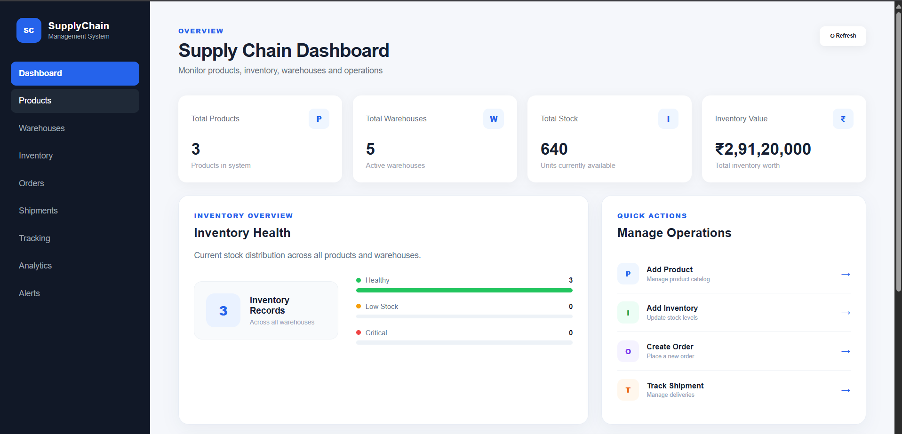

# Enterprise Logistics & Supply Chain Management System

A full-stack web application for managing products, warehouses, inventory, orders, shipments, tracking, analytics, and low-stock alerts.

The system uses React for the frontend, Spring Boot for the backend, and MySQL for data persistence.

## Dashboard Preview



## Overview

The Enterprise Logistics & Supply Chain Management System provides a centralized platform for managing day-to-day supply chain operations.

It allows users to:

- Manage products
- Manage warehouses
- Track inventory levels
- Create and manage orders
- Create and manage shipments
- Track shipments using tracking numbers
- Monitor inventory analytics
- Identify low-stock inventory
- View supply chain information through a dashboard

## Features

### Dashboard

The dashboard provides an overview of the entire supply chain system.

It displays:

- Total products
- Total warehouses
- Total stock
- Total inventory value
- Inventory health
- Recent inventory records
- Quick management actions

### Product Management

Users can:

- Add products
- View products
- Update product information
- Delete products
- Manage product codes, names, descriptions, and prices

### Warehouse Management

Users can:

- Add warehouses
- View warehouses
- Update warehouse information
- Delete warehouses
- Manage warehouse codes, locations, and managers

### Inventory Management

Users can:

- Add inventory
- Update stock quantities
- View inventory records
- Delete inventory
- Associate products with warehouses

The system prevents duplicate product-warehouse inventory records.

### Order Management

Users can:

- Create orders
- View orders
- View individual orders
- Update order status
- Delete orders

Orders are associated with products and warehouses.

### Shipment Management

Users can:

- Create shipments
- View shipments
- Update shipment status
- Delete shipments
- Assign carriers
- Generate tracking numbers

### Shipment Tracking

Shipments can be searched using their tracking number.

The system provides a dedicated tracking API for retrieving shipment information.

### Analytics

The analytics module provides:

- Inventory summary
- Total product count
- Total warehouse count
- Total stock
- Total inventory value

### Inventory Alerts

The system identifies low-stock inventory when the quantity falls below the configured threshold.

Low-stock alerts are available through the API and are also checked periodically by the backend scheduler.

## Technology Stack

### Frontend

- React
- JavaScript
- Vite
- React Router
- Axios
- HTML5
- CSS3

### Backend

- Java
- Spring Boot
- Spring Web
- Spring Data JPA
- JDBC
- Spring Scheduling
- Maven

### Database

- MySQL

### Development Tools

- Visual Studio Code
- Git
- GitHub
- Apache Maven
- Node.js
- npm

## System Architecture

```text
                 ┌─────────────────────┐
                 │     React Frontend  │
                 │     Port: 5173      │
                 └──────────┬──────────┘
                            │
                            │ REST API
                            ▼
                 ┌─────────────────────┐
                 │    Spring Boot      │
                 │     Backend         │
                 │     Port: 8081      │
                 └──────────┬──────────┘
                            │
                            │ JDBC / JPA
                            ▼
                 ┌─────────────────────┐
                 │       MySQL         │
                 │   logistics_db      │
                 └─────────────────────┘